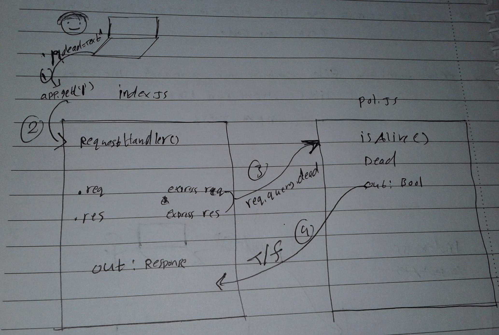

# LAB - Class 00

## Project: prof of life

### Author: osama mousa

### Links and Resources

- [submission PR](https://github.com/401-advanced-javascript-osama/lab-00/pull/1)
- [ci/cd](https://travis-ci.com/github/401-advanced-javascript-osama/lab-00) (GitHub Actions)
- [front-end application](https://osama-lab-00.herokuapp.com/) (when applicable)

### Documentation

* [jsdoc](https://osama-lab-00.herokuapp.com/docs/)

### Modules

#### `pos.js`

##### `isAlive(dead) -> boolean`

Return true/false

### Setup

#### `.env` requirements (where applicable)

i.e.

- `PORT` - Port Number

#### How to initialize/run your application (where applicable)

- e.g. `npm start`

- Endpoint : `/`
    - Retarns a boolean

- Endpoint : `/docs`
    - Retarns a jsdoc Documentation pages

#### How to use your library (where applicable)

#### Tests
- Unit Tests : `npm test`
- Unit Tests : `npm run lint`

#### UML

